# Excel Table Detection and Extraction

This project provides a robust solution for detecting and extracting tables from Excel files, handling various complexities such as merged cells, multi-level headers, and multiple tables within the same sheet.

## Approach to Detecting Tables

Our table detection approach follows these key steps:

1. **Data Extraction**: 
   - Extract raw data from Excel files while preserving merged cell structure
   - Handle both data values and formulas to maintain complete information

2. **Table Boundary Detection**:
   - Create a binary mask to identify non-empty cells
   - Use row continuity analysis to detect potential table regions
   - Define table boundaries based on empty row patterns

3. **Table Merging Analysis**:
   - Analyze patterns before and after empty rows to determine if adjacent data blocks belong to the same logical table
   - Use similarity metrics for making merging decisions

4. **Header Detection and Processing**:
   - Identify potential header rows through type analysis and pattern recognition
   - Process multi-level headers to create meaningful column names
   - Use LLM assistance for complex header scenarios

5. **Post-processing and Validation**:
   - Apply validation rules to ensure extracted tables are meaningful
   - Use LLM for quality checking and metadata extraction
   - Clean and format the final tables for downstream use

## Assumptions Made in Code

1. **Table Separation**: 
   - **Assumption**: Tables are primarily separated by empty rows
   - **Justification**: Follows common spreadsheet design practices where visual separation indicates logical separation

2. **Merging Decision Thresholds**:
   - **Assumption**: Tables should be merged if they have >70% dense row similarity OR >60% column similarity and the first row isn't header-like
   - **Justification**: These thresholds balance precision and recall in table detection

3. **Header Detection**:
   - **Assumption**: Headers typically have different data types (strings) compared to data rows (mixed, often numeric)
   - **Justification**: This type distribution difference helps distinguish headers from data

4. **Multi-level Header Detection**:
   - **Assumption**: If column names have <20% uniqueness or a single value appears in >50% of columns, it might be a multi-level header
   - **Justification**: These patterns typically indicate headers spanning multiple rows

5. **Table Validity**:
   - **Assumption**: Valid tables shouldn't have >75% similar values per row, >75% identical column names, or >25% error values
   - **Justification**: These criteria help filter out non-tabular data or formatting artifacts

## Important Functions and Their Necessity

### Pre-processing Functions

1. **`detect_and_extract_tables`**:
   - **Purpose**: Main orchestrator function that processes Excel files and extracts tables
   - **Importance**: Provides the entry point and overall workflow management

2. **`_get_data_with_merged_cells`**:
   - **Purpose**: Extracts data from Excel sheets while preserving merged cell information
   - **Importance**: Crucial for maintaining data integrity as merged cells are common in Excel and can disrupt regular grid structure

3. **`_detect_tables_in_data`**:
   - **Purpose**: Identifies table boundaries and converts data regions into structured DataFrames
   - **Importance**: Core function for distinguishing tables from surrounding content

4. **`_should_merge_tables`**:
   - **Purpose**: Analyzes patterns to determine if adjacent data blocks should be merged
   - **Importance**: Essential for correctly identifying logical tables that may be visually separated

5. **`set_next_row_as_header`**:
   - **Purpose**: Recursively evaluates rows to find appropriate headers
   - **Importance**: Handles cases where the initial row might not contain the actual column names

### Post-processing Functions

6. **`clean_tables`**:
   - **Purpose**: Validates and processes extracted tables
   - **Importance**: Ensures quality and consistency of the final output

7. **`llm_qc_check`**:
   - **Purpose**: Uses LLM for quality checking and metadata extraction
   - **Importance**: Leverages AI capabilities for complex decisions and enrichment

8. **`is_dataframe_valid`**:
   - **Purpose**: Validates DataFrames against specific criteria
   - **Importance**: Filters out invalid or meaningless tables

9. **`llm_multi_level_header_correction`**:
   - **Purpose**: Uses LLM to correct multi-level headers
   - **Importance**: Handles complex header structures that rule-based approaches struggle with

## Challenges Faced and Solutions

1. **Merged Cells**:
   - **Challenge**: Merged cells create irregular data structures that break the grid assumption
   - **Solution**: Duplicate the merged cell value into all constituent cells while preserving the original structure

2. **Table Boundary Detection**:
   - **Challenge**: Determining where tables begin and end, especially with varying empty row patterns
   - **Solution**: Analyze row continuity with adaptive empty row tolerance

3. **Multi-level Headers**:
   - **Challenge**: Headers that span multiple rows with hierarchical information
   - **Solution**: Combine LLM analysis with pattern detection to identify and process complex headers

4. **Similar Tables Separation**:
   - **Challenge**: Deciding whether adjacent similar tables should be merged or kept separate
   - **Solution**: Use detailed similarity metrics covering dense rows, column patterns, and data type distributions

5. **Header vs. Data Recognition**:
   - **Challenge**: Distinguishing header rows from data rows
   - **Solution**: Analyze type distributions and patterns with both rule-based and LLM approaches

## Future Scope

1. **Horizontal Table Detection**:
   - Currently handles vertically separated tables; could be extended to detect horizontally adjacent tables

2. **Advanced Header Validation**:
   - Improve invalid header detection and correction mechanisms

3. **ML-based Classification**:
   - Replace percentage-based thresholds with trained ML models for more adaptive decision making

4. **Performance Optimization**:
   - Optimize for very large Excel files with selective processing strategies

5. **Formula Analysis**:
   - Enhanced formula handling to better interpret calculated values and their relationships

## Limitations of the Approach

1. **Horizontal Tables**: 
   - Current implementation focuses on vertically separated tables; horizontally adjacent tables may not be detected correctly

2. **Fixed Thresholds**:
   - Relies on percentage-based thresholds that may not be optimal for all spreadsheet styles

3. **OpenAI**:
   - Sometimes, the OpenAI API throws an error during Pydantic validation. This can be resolved by splitting a large prompt into smaller parts.

4. **Complex Layouts**:
   - May struggle with highly non-standard layouts or decorative elements in spreadsheets

5. **Formula Interpretation**:
   - Limited ability to interpret complex formula relationships across tables

## How to Run the Code

### Prerequisites

```bash
# Install required packages
pip install -r requirements.txt
```

### Environment Setup

Create a `.env` file with your API keys:
```
OPENAI_API_KEY = "your_openai_api_key"
ANTHROPIC_API_KEY = "your_anthropic_api_key"
```

### Usage

```python
from main import run

# Run with Anthropic model (default)
tables = run("path/to/your/excel_file.xlsx")

# Or run with OpenAI model
tables = run("path/to/your/excel_file.xlsx", model_name="openai")

# Process the extracted tables
for table in tables:
    sheet_name = table["sheet_name"]
    dataframe = table["table"]
    description = table["description"]
    
    print(f"Table from sheet: {sheet_name}")
    print(f"Description: {description}")
    print(dataframe.head())
    print("-" * 50)
```

### Sample Output

```
Table from sheet: employee_1
Description: This is a summary financial table showing payment details. It consists of 3 rows: the total amount, TDS (Tax Deducted at Source) deduction, and the final paid amount after TDS. The table shows a total of 103,990, a TDS deduction of 10,399, and a final paid amount of 93,591.

This table presents a comprehensive aggregation of data of previous table
   Description  Amount
0       Total  103990
1      (-)TDS   10399
2        Paid   93591
--------------------------------------------------
```
### To run streamlit app

```
streamlit run main_st.py
```
App will run at [http://localhost:8501/](http://localhost:8501/)


## Detailed Code Flow Diagram

